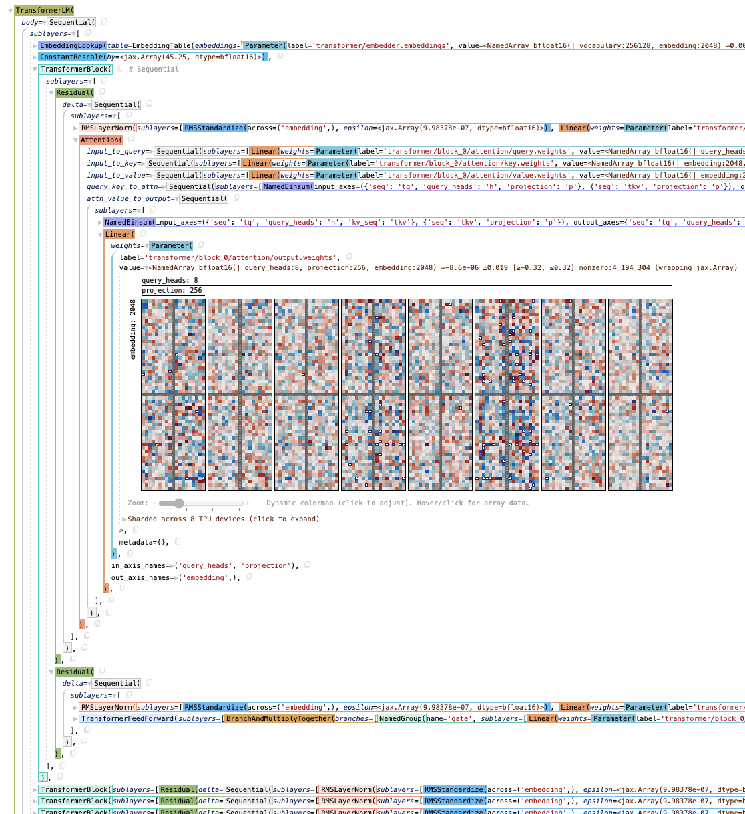

# Penzai

> **盆 ("pen", tray) 栽 ("zai", planting)** - *an ancient Chinese art of forming
  trees and landscapes in miniature, also called penjing and an ancestor of the
  Japanese art of bonsai.*

Penzai is a JAX library for writing models as legible, functional pytree data
structures, along with tools for visualizing, modifying, and analyzing them.
Penzai focuses on **making it easy to do stuff with models after they have been
trained**, making it a great choice for research involving reverse-engineering
or ablating model components, inspecting and probing internal activations,
performing model surgery, debugging architectures, and more. (But if you just
want to build and train a model, you can do that too!)

With Penzai, your neural networks could look like this:



Penzai is structured as a collection of modular tools, designed together but
each useable independently:


* A superpowered interactive Python pretty-printer:

  * [Treescope](https://treescope.readthedocs.io/en/stable/) (`pz.ts`):
    A drop-in replacement for the ordinary IPython/Colab renderer, originally
    a part of Penzai but now available as a standalone package. It's designed to
    help understand Penzai models and other deeply-nested JAX pytrees, with
    built-in support for visualizing arbitrary-dimensional NDArrays.

* A set of JAX tree and array manipulation utilities:

  * `penzai.core.selectors` (`pz.select`): A pytree swiss-army-knife,
    generalizing JAX's `.at[...].set(...)` syntax to arbitrary type-driven
    pytree traversals, and making it easy to do complex rewrites or
    on-the-fly patching of Penzai models and other data structures.

  * `penzai.core.named_axes` (`pz.nx`): A lightweight named axis system which
    lifts ordinary JAX functions to vectorize over named axes, and allows you to
    seamlessly switch between named and positional programming styles without
    having to learn a new array API.

* A declarative combinator-based neural network library, where models are
  represented as easy-to-modify data structures:

  * `penzai.nn` (`pz.nn`): An alternative to other neural network libraries like
    Flax, Haiku, Keras, or Equinox, which exposes the full structure of your model's
    forward pass using declarative combinators. Like Equinox, models are
    represented as JAX PyTrees, which means you can see everything your model
    does by pretty printing it, and inject new runtime logic with `jax.tree_util`.
    However, `penzai.nn` models may also contain mutable variables at the leaves
    of the tree, allowing them to keep track of mutable state and parameter
    sharing.

* A modular implementation of common Transformer architectures, to support
  research into interpretability, model surgery, and training dynamics:

  * `penzai.models.transformer`: A reference Transformer implementation that
  can load the pre-trained weights for the Gemma, Llama, Mistral, and
  GPT-NeoX / Pythia architectures. Built using modular components and named
  axes, to simplify complex model-manipulation workflows.

Documentation on Penzai can be found at
[https://penzai.readthedocs.io](https://penzai.readthedocs.io).

> [!IMPORTANT]
> Penzai 0.2 includes a number of breaking changes to the neural network API.
> These changes are intended to simplify common workflows
> by introducing first-class support for mutable state and parameter sharing
> and removing unnecessary boilerplate. You can read about the differences
> between the old "V1" API and the current "V2" API in the
> ["Changes in the V2 API"][v2_differences] overview.
>
> If you are currently using the V1 API and have not yet converted to the V2
> system, you can instead keep the old behavior by importing from the
> `penzai.deprecated.v1` submodule, e.g. ::
>
> ```python
> from penzai.deprecated.v1 import pz
> from penzai.deprecated.v1.example_models import simple_mlp
> ```

[v2_differences]: https://penzai.readthedocs.io/en/stable/guides/v2_differences.html


## Getting Started

If you haven't already installed JAX, you should do that first, since the
installation process depends on your platform. You can find instructions in the
[JAX documentation](https://jax.readthedocs.io/en/latest/installation.html).
Afterward, you can install Penzai using

```python
pip install penzai
```

and import it using

```python
import penzai
from penzai import pz
```

(`penzai.pz` is an *alias namespace*, which makes it easier to reference
common Penzai objects.)

When working in an Colab or IPython notebook, we recommend also configuring
Treescope (Penzai's companion pretty-printer) as the default pretty printer, and
enabling some utilities for interactive use:

```python
import treescope
treescope.basic_interactive_setup(autovisualize_arrays=True)
```

Here's how you could initialize and visualize a simple neural network:

```python
from penzai.models import simple_mlp
mlp = simple_mlp.MLP.from_config(
    name="mlp",
    init_base_rng=jax.random.key(0),
    feature_sizes=[8, 32, 32, 8]
)

# Models and arrays are visualized automatically when you output them from a
# Colab/IPython notebook cell:
mlp
```

Here's how you could capture and extract the activations after the elementwise
nonlinearities:

```python
@pz.pytree_dataclass
class AppendIntermediate(pz.nn.Layer):
  saved: pz.StateVariable[list[Any]]
  def __call__(self, x: Any, **unused_side_inputs) -> Any:
    self.saved.value = self.saved.value + [x]
    return x

var = pz.StateVariable(value=[], label="my_intermediates")

# Make a copy of the model that saves its activations:
saving_model = (
    pz.select(mlp)
    .at_instances_of(pz.nn.Elementwise)
    .insert_after(AppendIntermediate(var))
)

output = saving_model(pz.nx.ones({"features": 8}))
intermediates = var.value
```

To learn more about how to build and manipulate neural networks with Penzai,
we recommend starting with the "How to Think in Penzai" tutorial ([V1 API version][how_to_think_1], [V2 API version][how_to_think_2]), or one
of the other tutorials in the [Penzai documentation][].

[how_to_think_1]: https://penzai.readthedocs.io/en/stable/notebooks/how_to_think_in_penzai.html
[how_to_think_2]: https://penzai.readthedocs.io/en/stable/notebooks/how_to_think_in_penzai.html
[Penzai documentation]: https://penzai.readthedocs.io


---

*This is not an officially supported Google product.*
